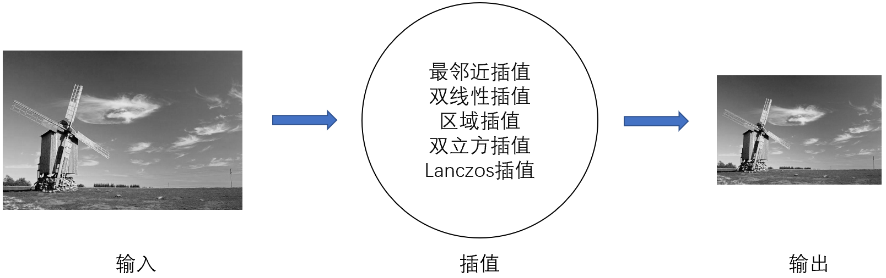
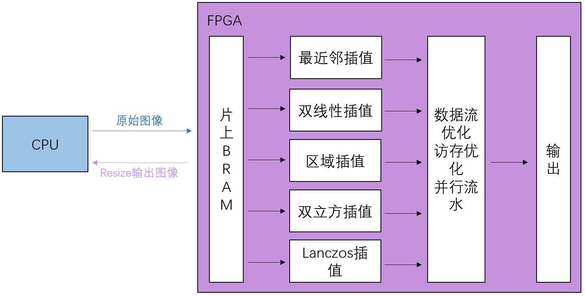

#### 基于PYNQ的Resize算法加速设计 （刘珂 曹美）

**1.背景**

随着人工智能的快速发展，神经网络在计算机视觉、自然语言处理、自动驾驶等领域应用广泛，特别是卷积神经网络，在图像识别、目标检测等应用中效果显著。其中目标检测对视频图像中的目标进行分类和定位，为后续对目标进行处理做了准备，具有很大的应用前景，也是重要的研究热点。近年来，国内外众多科研机构都提出了较好的目标检测算法，不断刷新目标检测精度的排行榜，但在这些算法设计中，都将图像预处理操作部署在ARM端。Resize算法是图像预处理的主要操作，若将其部署在FPGA端，可以实现进一步的加速，从而推动目标检测算法更加实时、高效的实现。

**2.Resize算法原理**

图1 Resize算法原理

图像的预处理主要目的是消除图像中的无关信息，恢复有用的真实信息，最大限度地简化数据，从而改进特征提取、图像分割、匹配和识别的可靠性。一般预处理流程为灰度化、几何变换（Resize）、图像增强。

Resize算法原理如图1所示，其输入是灰度化后的原图像，大小并未改变；经过指定的插值方式计算后，图像的大小缩放到Size(width，height)函数指定的大小，图像的内容仍与原图像相同。

**3.硬件实现**

图2 整体架构

在HLS中分别将含五种插值方法的Resize算法进行硬核化，在此过程中，使用数据流优化技术、访存优化技术和并行流水技术对算法进行优化，使其在加速和资源利用量两方面达到一个平衡点，在资源利用尽可能少的情况下，实现高速、实时的图像Resize。

**4.实验方案**

基于以上研究内容，本项目中所提方案的验证将从以下两个方面展开。首先，在ARM端部署Resize算法，并使用五种不同的插值方法，分别统计不同大小的输入图像进行Resize操作的时间。其次，使用HLS高层次综合工具将Resize算法硬件化，利用数据流优化，访存优化，并行流水等技术进行算法层面的优化，之后将其部署到PYNQ开发板，同样统计不同大小的输入图像在FPGA端进行Resize操作的时间，并与ARM端相比较。